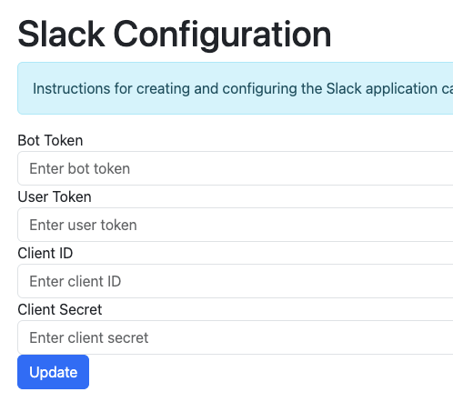
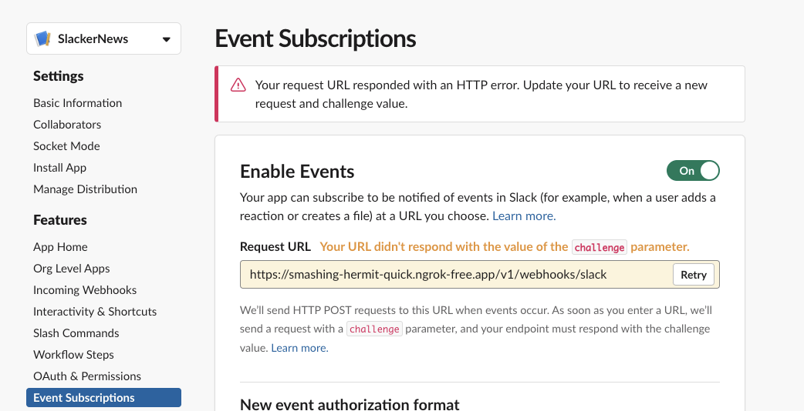

# Contributing to SlackerNews

## Creating an environment

### Initial Setup

You can run a local version of SlackerNews that connects to a sqlite database by running `yarn run dev` from the `./slackernews` directory.

##### Install dependencies

```
cd slackernews
yarn
```

##### Set up .env.local

In order to log in via Slack, you need a redirect_uri that can't be localhost. We recommend ngrok, and using that to access your local dev env.

```
ngrok http --subdomain=you 3000
```

You can configure Google Auth and Slack by editing the `.env.local` file:

```
NEXT_PUBLIC_API_ENDPOINT=http://localhost:3000
SLACK_AUTH_REDIRECT_URI=https:/<ngrok or something>/login/callback
DB_URI="./slackernews.db"
```


##### Run Server

Once you have an ngrok server and your `.env.local` set up, you can run the server

```
yarn run dev
```

This will run the server in demo mode -- to use real data, you'll need to 
[configure a slack application](https://docs.slackernews.io/slack/)

### Configuring a slack app

To create a Slack app, start by checking the docs at https://docs.slackernews.io/slack/. 
Once you've created the app, enter your credentials at https://localhost:3000/admin/slack



You'll also need to add your [ngrok URL from .env.local](#set-up-envlocal) as an authorized redirect URL for your slack app.

You should also verify your events subscription URL is responding properly:



### Building and running the helm chart

See [chart/slackernews/README.md](./chart/slackernews/README.md)

### Creating a replicated release


### Iterating on Chart Preflight and Support Bundle specs locally

```shell
helm template ./chart/slackernews | kubectl preflight -
# or
helm template ./chart/slackernews | kubectl support-bundle -
```


